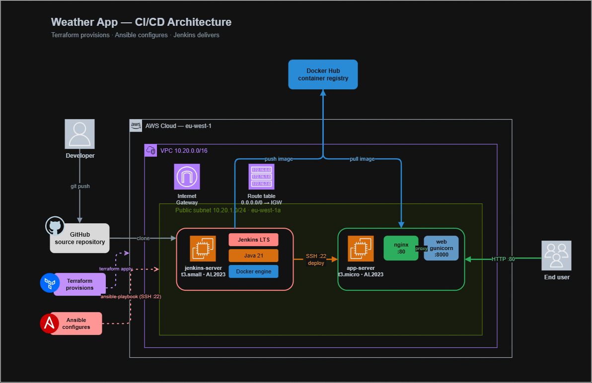
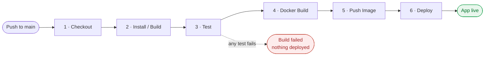
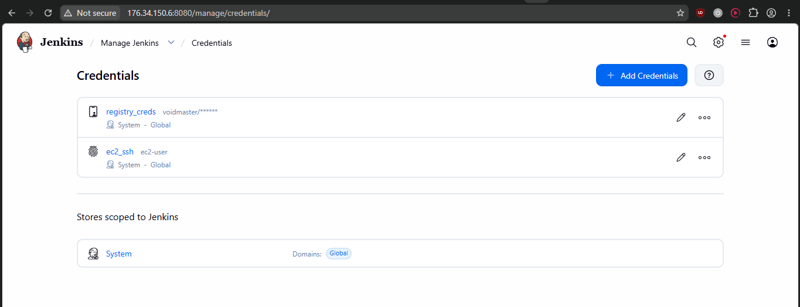
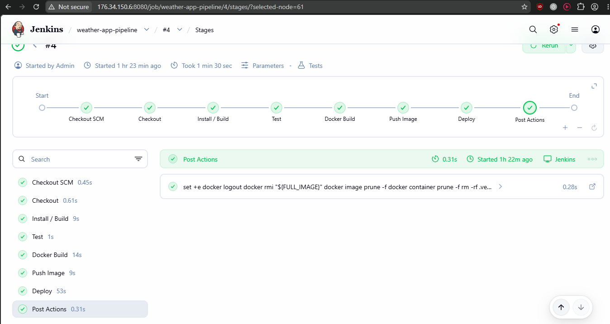
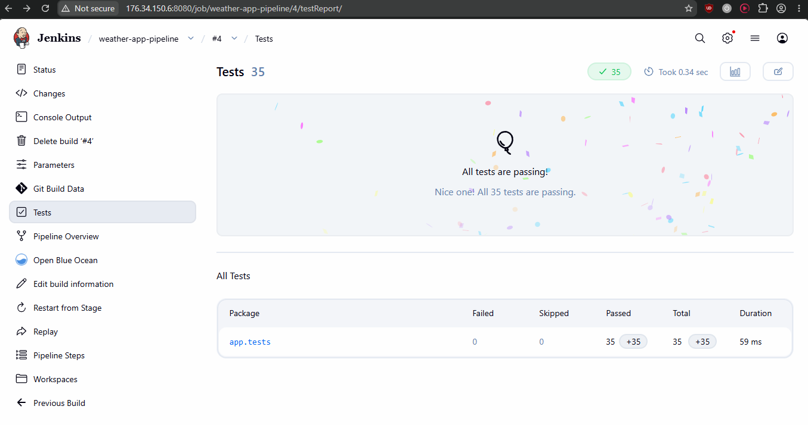
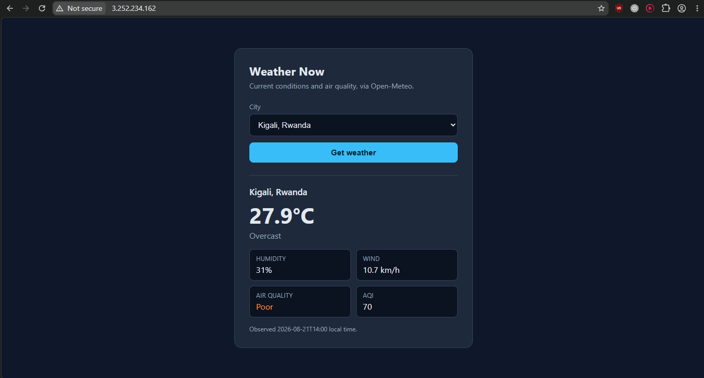
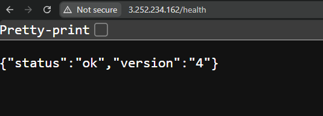

# Weather App — End-to-End CI/CD Pipeline with Jenkins

A complete CI/CD pipeline that builds, tests, containerises and deploys a Flask
web service to AWS EC2 — with the infrastructure provisioned by Terraform and
configured by Ansible.

The application itself is deliberately small. The subject of this project is
everything around it: how a commit becomes a running container on a server,
without anyone touching that server by hand.

**Live:** http://3.252.234.162

---

## Contents

- [What this project does](#what-this-project-does)
- [The application](#the-application)
- [Architecture](#architecture)
- [The Jenkins pipeline](#the-jenkins-pipeline)
- [Tools and configuration evidence](#tools-and-configuration-evidence)
- [How to reproduce](#how-to-reproduce)
- [What I'd do differently](#what-id-do-differently)

---

## What this project does

The objective was to design and implement an end-to-end CI/CD pipeline in
Jenkins that builds, tests, containerises a simple web service, pushes the
image to a registry, and deploys it to an EC2 host.

Rather than configure the servers by hand, the whole environment is defined as
code across three layers, each answering a different question:

| Layer | Tool | Question it answers | Runs |
|---|---|---|---|
| Infrastructure | Terraform | What machines exist? | Once per environment |
| Configuration | Ansible | What software is on them? | Once, after Terraform |
| Delivery | Jenkins | How does a commit become a running app? | Every push |

**Terraform builds empty machines, Ansible makes them useful, Jenkins uses them
to ship the app.** The layers deliberately do not overlap: Terraform sets no
`user_data`, Ansible never ships application code, and Jenkins never edits
machine configuration.

---

## The application

A Flask service that reports current weather and air quality for a scoped list
of six cities, using the [Open-Meteo](https://open-meteo.com/) public API (no
API key required).

| Route | Purpose |
|---|---|
| `GET /` | Form with the six allowlisted cities |
| `POST /` | Looks up the city and renders temperature, humidity, wind, conditions, and a banded European AQI |
| `GET /health` | Returns `{"status": "ok", "version": "<build tag>"}` |
| `GET /nginx-health` | Answered by nginx itself, without touching the app |

The code is split into two modules for a specific reason:

- `app/app.py` — Flask routes and rendering only
- `app/weather.py` — everything that touches the network, plus the city
  allowlist and pure helper functions

That split is what makes the test suite trustworthy. The 35 tests replace
`requests.get` with a fake, so **CI never depends on Open-Meteo being
reachable** — the pipeline tests the code's behaviour, including timeouts,
malformed upstream responses, rejected cities, and AQI band boundaries, without
making a single network call.

`/health` reporting its own build tag is what makes the deploy verifiable — see
the pipeline section.

---

## Architecture



### How it fits together

Everything lives in a single VPC (`10.20.0.0/16`) with one public subnet,
an internet gateway, and a route table sending `0.0.0.0/0` to that gateway.

**Two EC2 instances, each with one job:**

The **Jenkins controller** (`t3.small`, Amazon Linux 2023) runs Jenkins LTS on
Java 21, plus Docker — because the pipeline builds images on this host. Its
security group allows `22` for Ansible and `8080` for the web UI.

The **app server** (`t3.micro`) runs only Docker and Docker Compose. Its
security group allows `80` from the internet, and `22` from inside the VPC so
the Jenkins controller can deploy to it.

**On the app server, two containers:**

```
internet :80 ──► nginx ──► web:8000 (gunicorn, 2 workers)
```

nginx is the sole ingress. The application container is `expose`d but never
published to the host, so nothing reaches gunicorn except through the proxy.
This is why there are two health endpoints: `/nginx-health` proves the proxy is
alive, `/health` proves the app behind it is. During a failed deploy, that
distinction tells you which half broke.

**Docker Hub** sits outside the VPC as the handoff point. Jenkins pushes an
image; the app server pulls it. The two servers never transfer the application
directly — only the instruction to go and fetch it.

### The contract between Terraform and Ansible

Terraform tags each instance with `Role = "jenkins"` or `Role = "app"`.
Ansible's dynamic inventory queries EC2 for instances tagged
`Project = jenkins-cicd-lab` and turns the `Role` tag into the groups
`role_jenkins` and `role_app`.

That tag string is the entire interface between the two tools. There is no
static inventory file listing IP addresses, so rebuilding the infrastructure
never leaves a stale hosts file behind.

---

## The Jenkins pipeline

# Pipeline diagram preview



Six stages, defined declaratively in [`Jenkinsfile`](Jenkinsfile) and version
controlled alongside the application.

| # | Stage | What happens | Fails when |
|---|---|---|---|
| 1 | **Checkout** | Clones the repo, validates parameters, computes the image tag | Bad credentials, or a parameter left empty |
| 2 | **Install / Build** | Creates a virtualenv, installs runtime and dev dependencies | Dependency resolution fails |
| 3 | **Test** | Runs `pytest`, publishes JUnit XML to Jenkins | **Any of the 35 tests fails** |
| 4 | **Docker Build** | Builds the image from `app/`, stamping the tag in as `APP_VERSION` | Dockerfile or build error |
| 5 | **Push Image** | Logs into Docker Hub with `registry_creds`, pushes the tag | Bad registry credentials |
| 6 | **Deploy** | SSH to the app server with `ec2_ssh`, streams in `scripts/deploy.sh`, pulls and restarts, then curls `/health` | SSH failure, pull failure, or the app not answering |

Plus a `post { always }` block that removes the build's images from the
controller and prunes dangling layers — the lab's cleanup requirement, and a
practical necessity since every build otherwise leaves another image behind.

### The two ideas worth explaining

**Every image is uniquely tagged.** The tag is the Jenkins build number, and it
is baked into the container as `APP_VERSION` via a Docker build argument. So
`/health` on the running server reports exactly which build is live.

The alternative — tagging only `latest` — means you cannot answer "what is
running in production?" or roll back to a known-good version. `latest` is a
moving target.

**Deploy is a script, not inline commands.** `scripts/deploy.sh` is streamed to
the app server over SSH (`ssh host "VAR=... bash -s" < scripts/deploy.sh`), so
the script never has to exist on that server. The first version of this had the
commands inline in the Jenkinsfile as a heredoc: Groovy quoting inside shell
quoting inside SSH quoting, three levels deep and undebuggable. Moving it to a
file removed one whole level — and means the same script can be run by hand on
the server when a deploy needs diagnosing.

**Credentials never appear in the log.** Jenkins' Credentials Binding plugin
injects secrets as environment variables scoped to a single block and masks them
in console output. The registry password is piped via `--password-stdin` rather
than passed as an argument, so it never appears in the process list either.

### Boundaries the pipeline respects

The deploy stage rewrites exactly one file on the app server: a two-line `.env`
naming the image and version. It never touches `docker-compose.yml` — that file
is owned and templated by Ansible.

Application artefact and machine configuration stay on separate rails. Blurring
that line is the most common way projects like this become impossible to reason
about.

---

## Tools and configuration evidence

### Versions in use

| Tool | Version | Where |
|---|---|---|
| Jenkins | LTS | Jenkins controller |
| Java | Amazon Corretto 21 | Jenkins controller |
| Docker Engine | from AL2023 repos | Both hosts |
| Docker Compose | v2.32.4 (plugin) | Both hosts |
| nginx | 1.27-alpine | App server (container) |
| Python | 3.12-slim | App image |
| Amazon Linux | 2023 | Both hosts |
| Terraform | ≥ 1.5 | Workstation |
| Ansible | core ≥ 2.16 | Workstation |

Amazon Linux 2023 ships the Docker engine but **not** the Compose v2 plugin, so
the Ansible `common` role fetches the pinned release binary into
`/usr/libexec/docker/cli-plugins/`.

### Jenkins plugins

Pipeline, Git, Credentials Binding, Docker Pipeline, SSH Agent, JUnit.

### Jenkins credentials

| ID | Kind | Used by |
|---|---|---|
| `registry_creds` | Username with password | Push Image, Deploy (Docker Hub token) |
| `ec2_ssh` | SSH username with private key | Deploy (the Terraform-generated key) |


<!-- SCREENSHOT: Manage Jenkins > Credentials, showing the three IDs -->


### A successful pipeline run

<!-- SCREENSHOT: Stage View with all six stages green -->


<!-- SCREENSHOT: the JUnit test result page showing 35 passing -->



### The application, live

<!-- SCREENSHOT: browser at the EC2 public IP with a city selected and
     live weather rendered -->


<!-- SCREENSHOT: curl /health showing the version matching the build number -->


The `version` field in `/health` matches the Jenkins build number — which is
the proof that the container serving traffic is the one that build produced,
not a stale one left over from a previous deploy.


## How to reproduce

Full step-by-step instructions, from IAM user through teardown, are in
**[runbook.md](runbook.md)** — including a troubleshooting table for the failures
most likely to bite.

```
app/                  Flask source, tests, requirements, Dockerfile
terraform/            VPC, subnet, IGW, route table, security groups, key pair, 2× EC2
ansible/              dynamic EC2 inventory + common / jenkins / appserver roles
nginx/default.conf    reverse proxy config — one file, used locally and in production
scripts/deploy.sh     runs on the app server, streamed in over SSH
docker-compose.yml    local development stack (builds from source)
Jenkinsfile           the pipeline
docs/                 diagrams
screenshots/          evidence
```

Run it locally, nginx included, mirroring the production topology:

```bash
docker compose up --build      # http://localhost:8080
```

Or just the tests:

```bash
python -m venv .venv && source .venv/bin/activate
pip install -r app/requirements.txt -r app/requirements-dev.txt
pytest                         # 35 passing
```

---

## What I'd do differently

Honest notes on the limits of what's here.

**Tests run on a different Python than production.** The pipeline builds a
virtualenv with Amazon Linux's Python 3.9, while the container ships Python
3.12. Every pinned dependency supports both, so it passes — but the correct fix
is running the tests *inside* the built image, so you test exactly what you
ship.

**The security group module can't reference other security groups.** It accepts
CIDR blocks only, so "SSH from the Jenkins server" is expressed as the whole VPC
CIDR rather than as a source-security-group rule. Acceptable in a single-tenant
sandbox; in a shared VPC it would be too broad.

**The EC2 private key is in the Terraform state in plaintext.** That's inherent
to generating a key pair with Terraform. State lives in an encrypted S3 bucket
and is gitignored, but the sharpest edge in this project is that a state file
leak is a server compromise.

**No HTTPS.** nginx is in place precisely so TLS can be terminated there, but
this deployment serves plain HTTP on port 80.

**Deploy is push-based over SSH**, which is what the brief asked for. A
pull-based model — where the app server watches the registry — needs no inbound
SSH at all and is the better security posture.

**Two Compose files exist and they are not interchangeable.** The root one
builds from source for local work; the app server's is templated by Ansible and
pulls a published image. Documented, but a genuine trap for anyone new to the
repo.

### Problems solved along the way

Worth recording, because each cost real debugging time:

| Problem | Cause | Fix |
|---|---|---|
| Instance launch rejected — volume smaller than snapshot | The AMI filter `al2023-ami-*` matched the **ECS-neuron** variant with a 30 GB snapshot | Pinned the filter to `al2023-ami-2023.*-kernel-6.1-x86_64` |
| `Invalid for_each argument` on the route table | `for_each` keys must be known at plan time; subnet IDs are not | Switched the module to `count` |
| Security group rules failed on every re-apply | Ports specified alongside protocol `-1`, which AWS stores as null — a permanent diff | Module now sends null ports when the protocol is `-1` |
| Several-hundred-line dnf depsolve error | `curl` requested on AL2023, which ships `curl-minimal` | Dropped `curl` — the minimal package already provides the binary |
| Jenkins never scheduled a build | AL2023 sizes `/tmp` as a tmpfs at 50% of RAM; on 2 GB that's below Jenkins' 1 GiB threshold, taking the node offline | Pointed `java.io.tmpdir` at the EBS volume |
| `ssh-keyscan` failed in Ansible | `lookup('pipe', ...)` runs on the *controller*, which can't reach a private VPC IP | Ran the scan as a task on the Jenkins host instead |

---

## Cleanup

```bash
cd terraform && terraform destroy
```
